# This repository is outdated!  [Click here for the latest released version](https://github.com/dbiele/TypeScript-Cordova-SystemJS-Angular2-beta)
[https://github.com/dbiele/TypeScript-Cordova-SystemJS-Angular2-beta](https://github.com/dbiele/TypeScript-Cordova-SystemJS-Angular2-beta) 

- [x] This is a complete item
- [ ] This is an incomplete item

----------

## TypeScript + Cordova + SystemJS #

Installing the Software
-----------------------

## Visual Studio 2015 #

Windows and Web Development &gt; Microsoft Web Developer Tools
 HTML/JavaScript (Apache Cordova)
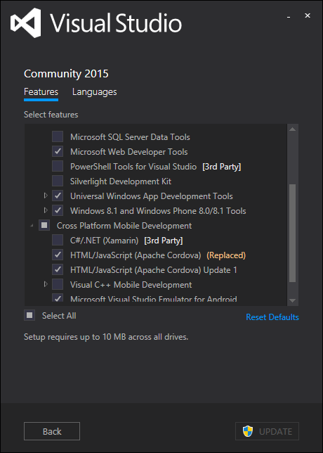

Visual Studio &gt; Extension and Updates

> Web Essentials 2015
> Open Command Line
> Add New File

# Updating config.xml #
-------------------
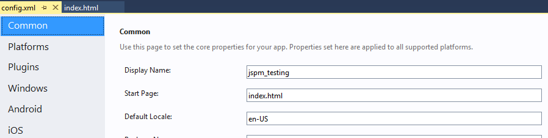
The config.xml contains the setting for the Corodova app. It’s also know as the configuration designer. You can also update the config.xml using View Code. Right click config.xml in Solution Explorer &gt; View Code.

### Common

Most of the information is straight forward. Here are some notes:

1.  Update the Common &gt; package name. Best practice: Package name should be domain name in reverse. io.github.dbiele

> Update Security for Cordova

1.  Cordova Security: Add external domains to config.xml Domain Access

    1.  Make sure access origin = \*

    2.  Or remove \* and add the names of the domains. <https://*.jspm.io> and <https://*.angularjs.org>. This is used for the index.html script tags

### Platforms / Apache Cordova

Update to specific versions of Cordova CLI using config.xml. Enter the version number into the text field. When the file is saved, the files are downloaded. You can get the latest version from this URL:
<https://github.com/apache/cordova-cli/releases>

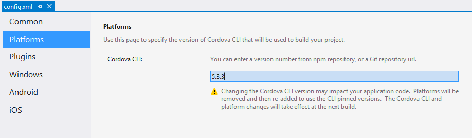

Alternatively you can Npm install –g cordova –s However, config.xml will always override.

### Plugins
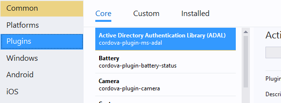

I would recommend adding the following plugins:

- Crosswalk

Add Cordova CrossWalk plugin. Config.xml &gt; plugins &gt; Crosswalk Webview. Note, if there’s a problem installing the apk to the device, delete the previous installs on the device.

- Cordova-plugin-whitelist

Add the “cordova-plugin-whitelist” to dependencies in config.xml. Whitelist is a core cordova plugin. Or use NPM to download the files and install locally.
<https://www.npmjs.com/package/cordova-plugin-whitelist>

- Other Popular Plugins
>
-  Cordova-plugin-console
>
-  Cordova-plugin-device
>
-  Cordova-plugin-inappbrowser
>
-  Cordova-plugin-dialogs
>
-  Cordova-plugin-splashscreen
>
-  Cordova-plugin-statusbar

### Windows
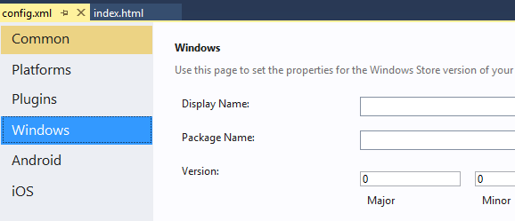
Again, this is pretty straightforward.

DisplayName: Use the DisplayName attribute to display a package name to users.

Package Name: Describes the contents of the package. A string between 3 and 50 characters in length that consists of alpha-numeric, period, and dash characters.

Change the Window Target Version to Windows 10.0. Debugging windows phone 8 requires Visual Studio 2013 installed.

### Android
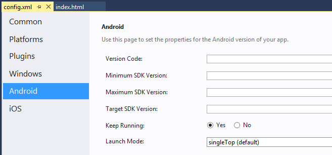
Version Code:
The value is an integer so that other applications can programmatically evaluate it, for example to check an upgrade or downgrade relationship. You can set the value to any integer you want, however you should make sure that each successive release of your application uses a greater value.
More Information: <http://developer.android.com/tools/publishing/versioning.html>
Version Numbering: <http://developer.android.com/about/dashboards/index.html>

*Minimum SDK Version:*
Update Minimum SDK Version to 14. This is because we’ll use cordova-android 4.1.0 or greater.
<http://developer.android.com/guide/topics/manifest/uses-sdk-element.html>

*Maximum SDK Version:*
An integer designating the maximum API Level on which the application is designed to run. If the application's maxSdkVersion attribute is lower than the API Level used by the system itself, then the system will not allow the application to be installed. Future versions of Android (beyond Android 2.0.1) will no longer check or enforce the maxSdkVersion attribute during installation or re-validation. Only used by the google store.

*Target SDK:*
An integer designating the API Level that the application targets. If not set, the default value equals that given to minSdkVersion

### IOS
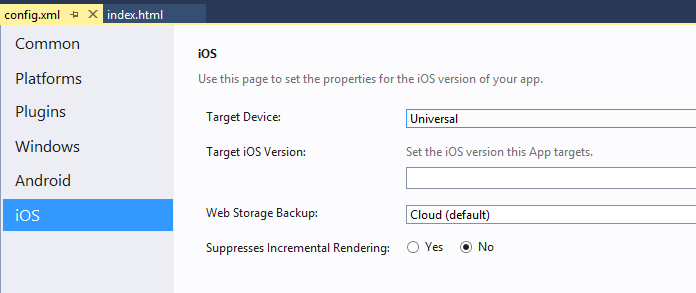
*Target Device*
Set the target device to universal. Setting to a specific device to run application on a specific device or emulator

*Target iOS Version:*
•iOS SDK 7.0 or later

// TODO: Need more informationi

*Web Storage Backups:*
Default is good.
Local saves data to NSLibraryDirectory or NSDocumentDirectory and will persist after a backup restore of device. Set to cloud to allow web storage data to backup via iCloud. Set to local to allow only local backups via iTunes sync. Set to none prevent web storage backups.

## Disable the Web Bounce Effect ##

Remember to isable the web bounce effect. When scrolling to the bottom of a page, the web view will indicate the bottom by bouncing or flashing.

To stop the effect, use the following in config.xml
 Android, IOS, Windows:

&lt;preference name="disallowOverscroll" value="true" /&gt;
 &lt;preference name="webviewbounce" value="false" /&gt;

Res Folder Update
Update folder Res images. Res images contains icons and splash screens for resolution specific devices.

Update the config.xml
 The images are missing from the default res &gt; icon &gt; windows folder.

> &lt;icon src="res/icons/windows/Square44x44Logo.scale-100.png" width="44" height="44" /&gt;
> &lt;icon src="res/icons/windows/Square71x71Logo.scale-100.png" width="71" height="71" /&gt;

Update Typescript to latest version
-----------------------------------

Download typescript for Visual Studio 2015

<http://www.microsoft.com/en-us/download/details.aspx?id=48593>
 Click the details button to reveal a list of all version. Download the appropriate version 

Installing the TypeScript CLI does not upgrade Visual Studio 2015 to use that version.

    C:\\Program Files (x86)\\Microsoft SDKs\\TypeScript\\1.5\\tsc
    
    npm install -g typescript
     
    npm install -g typescript@next
     
    tsc –version
     
    where tsc

## Confirm Android SDK Manager is installed ##

Check if you have all the SDK’s by clicking Tools &gt; Options &gt; Tools for Apache Cordova &gt; Cordova Tools &gt; Run Dependency Checker.

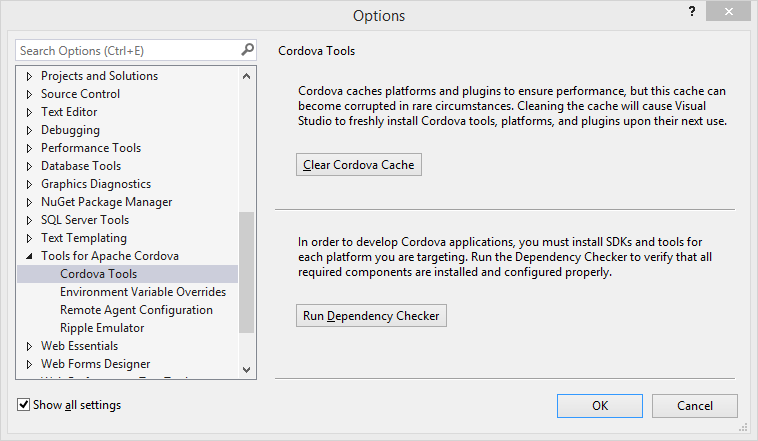
 Java JDK is installed and using 64bit version. Ie C:\\Program Files\\Java\\jdk1.8.0\_60
 Tools &gt; Options &gt; Tools for Apache Cordova

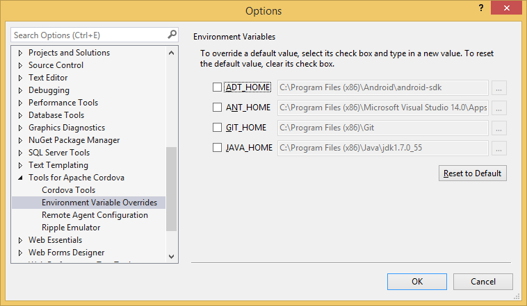

1.  Update Cordova-Android to latest version. Instructions on how to do it.
    add to config.xml &lt;engine name="android" spec="4.1.0" /&gt;
    Use these instructions to install globally
    <http://cordova.apache.org/announcements/2015/07/21/cordova-android-4.1.0.html>
    If the project is published, before updating the config.xml then you’ll need to use the command prompt to upgrade the cordova-android version. Use this:
    \`cordova platform remove android\`
    Latest Releases: <https://github.com/apache/cordova-android/releases>

Taco.json
---------

Confirm taco.json has been updated with the latest version of cordova set in config.xml. Taco is used for IOS building and the remote agent uses the CLI version defined in the taco.json.

Tsconfig.json
-------------

Confirm scripts/tsconfig.json exists in scripts folder

1.  Compile with AMD. Make sure this is set in the tsconfig.json file. Add "module": "amd"

    {
      "compilerOptions": {
    "noImplicitAny": false,
    "noEmitOnError": true,
    "removeComments": false,
    "sourceMap": true,
    "target": "es5",
    "module": "amd",
    "emitDecoratorMetadata": true,
    "experimentalDecorators": true,
    "outDir": "../MANAGEMENT/md/www/scripts/"
      },
      "files": [
    "./MANAGEMENT/md/index.ts",
    "./MANAGEMENT/md/app.ts",
    "./MANAGEMENT/md/typings/tsd.d.ts"
      ]
    }

Exclude is another option. However, if exclude is used you must not use “files” object.

    "exclude": \[
    "../MANAGEMENT/md/node\_modules",
    "../MANAGEMENT/md/www"
    \]

Solution Explorer
-----------------

Make sure to show all files in the solution explorer.

Windows Keystore
----------------

Add Keystores for Windows release builds.

1.  Update build.json to include keystore for releasing to device. Publishing in release mode requires build.json to include keystore.

    1.  Create a keystore and save it locally. Information on how to create keystore
        <https://github.com/Microsoft/cordova-docs/blob/master/articles/tutorial-package-publish/tutorial-package-publish-readme.md>

    2.  Update build.json to include keystore information.

    3.  Note: If errors occur, this may be due to previous version of app on device. Delete app on device and rebuild.

Install d.ts files for TypeScript
---------------------------------

1.  Install TSD and configure TSD to manage d.ts files. This only needs to be done once.

    npm install tsd –g

2.  Open the command prompt/powershell at the scripts folder and Install system d.ts file using tsd.

    tsd install systemjs –s

3.  configure TSD to install files in proper location

    1.  Move the tsd.json file to the root of the project

    2.  Change the “path” and “bundle” in tsd.json to point to new folder scripts/typings

    3.  Create TSD task in gulp – see creating tsd gulp task.

    4.  Reinstall d.ts files by running gulp task

Note: When adding new d.ts files with tsd, make sure to open powershell or command line in the same folder as tsd.json.

Delete d.ts files by removing the element from tsd.json and then run `tsd reinstall --clean`

Adding Gulp Tasks
-----------------

### Install gulp-tslint

1.  Add to package.json DevDependencies 

	"gulp-tslint"

2.  Add the following to gulpfile.js:

gulp.task(**'tslint'**, function () {

    // Built-in rules are at
    // https://github.com/palantir/tslint\#supported-rules
    var tslintConfig = {
    "rules": {
    "semicolon": true,
    "requireReturnType": true,
    "requireParameterType": true,
    "jsdoc-format": true,
    "quotemark": \[true, "single"\],
    "variable-name": \[true,"allow-leading-underscore"\]
    }
    };
    
    return gulp.src(\['scripts/\*\*/\*.ts', '!scripts/typings/\*\*'\])
    //Custom rules can be added to configuration. rulesDirectory: 'folder/folder'
    .pipe(tslint({ configuration: tslintConfig }))
    .pipe(tslint.report('verbose', { emitError: true, reportLimit: 0 }));
    });

### Install SASS

1.  Add to package.json devDependencies

    1.  Gulp-sass

    2.  Gulp-autoprefixer

    3.  Es6-promise

2.  Add the following to gulpfile.js

    require('es6-promise').polyfill();
    gulp.task(**'build.css.sass'**, function () {
    gulp.src('./MANAGEMENT/md/scripts/components/materials/components/\*\*/\*.scss')
    // Guilp-Sass runs the pre processor on the .scss files using Sass.
    // Gulp-AutoPrefixer post processes the .css files using PostCSS.
    // CSS and Folder structure is saved to destination folder.
    .pipe(sass().on('error', sass.logError))
    .pipe(prefixer({
    browsers: \['last 2 versions'\],
    cascade: false
    }))
    .pipe(gulp.dest('./MANAGEMENT/md/www/css'));
    > });

### Add install tsd

    gulp.task(**'install.tsd'**, function (callback) {
    ts({
    command: 'reinstall',
    config: './MANAGEMENT/md/tsd.json'
    }, callback);
    });

### Add Browsersync

    var browserSync = require('browser-sync');
    gulp.task(**'browser.sync'**, function () {
    browserSync.init({
    server: {
    baseDir:"./MANAGEMENT/md/www/"
    }
    });

# Updating Index.html #
----------

Update www/index.html

1.  `&lt;meta charset="utf-8" /&gt;`

2.  `&lt;meta http-equiv="X-UA-Compatible" content="IE=edge,chrome=1" /&gt;`
    use the latest engine to render the page and execute JavaScript.

3.  `&lt;meta http-equiv="expires" content="wed, 7 Oct 2015 01:00:00 GMT" /&gt;`

4.  `&lt;meta name="viewport" content="width=device-width, initial-scale=1"&gt;`
    initial-scale property controls the zoom level when the page is first loaded.
    The maximum-scale, minimum-scale, and user-scalable properties control how users are allowed to zoom the page in or out.
    Width can be set to a specific number of pixels like width=600 or to the special value device-width value which is the width of the screen in CSS pixels at a scale of 100%

5.  `&lt;meta name="description" content="Visual Studio 2015, Cordova, TypeScript, Starter"&gt;`

6.  `&lt;link rel="shortcut icon" href="favicon.ico" /&gt;`
    Make sure to add a favicon.ico to the www folder. Note: Cordova will automatically look for favicon.ico

7.  The following code needs to be added index.html to allow for the CDN’s, Frameworks and JavaScript to work correctly.  This is a security issue.
    &lt;meta http-equiv="Content-Security-Policy" content="default-src 'self' data: gap: 'unsafe-eval'; style-src 'self' 'unsafe-inline'; media-src \*"&gt;

    &lt;meta http-equiv="Content-Security-Policy" content="default-src https: 'self' \*.jspm.io data: gap: https://ssl.gstatic.com 'unsafe-eval' 'unsafe-inline' ws://localhost:\*; script-src 'self' 'unsafe-eval' 'unsafe-inline' https://\*.jspm.io https://\*.angularjs.org; media-src \*"&gt;

8. Move the cordova.js and platofrmoverrrides.js from the body to the head.

9. Remove the `&lt;script src="scripts/appBundle.js"&gt;&lt;/script&gt;` . We’ll use systemJS’s system.import to load .js files.

# How to add SystemJS to our project. #

Use JSPM for our package manager and it includes systemjs by default.  No need to download the systemjs package seperately.
Original documentation: https://github.com/jspm/jspm-cli/blob/master/docs/getting-started.md

Install the jspm file in our project folder. Open powershell in root folder of project.
npm install jspm --save-dev
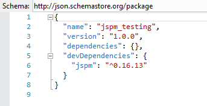

Use jspm init to create project configuration file, JSPM folder structure and install systemjs

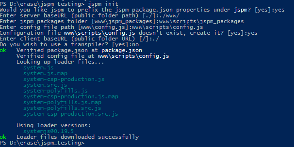

Jspm init

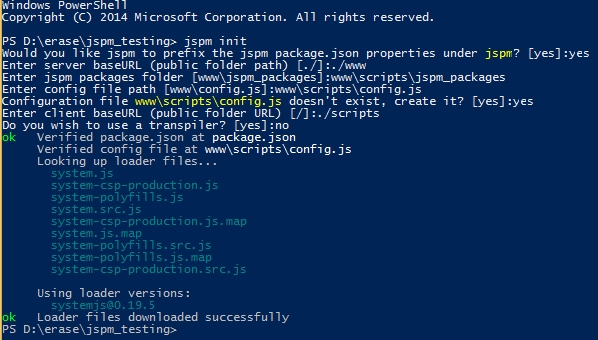

## Adding JSPM packages: ##

Example jQuery

    jspm install jquery
or
add name to packages.json jspm &gt; dependencies. Example: 
"jquery": "github:components/jquery@^2.1.4"
`jspm update` with powershell

Example folder structure using jspm install angular2.  Not fun:(

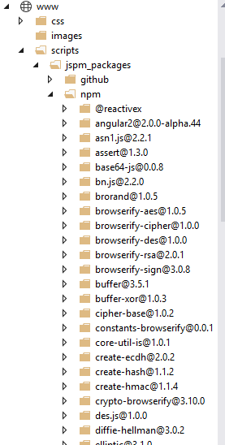

## Remove a package ##
jspm uninstall nameofpackage

Or

open package.json and click on the light bulb Uninstall package
    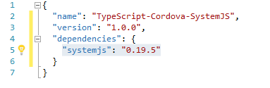

## Using SystemJS to load external modules. ##

    System.import('index')

‘index’ is the name of the js file that needs to load. Because defaultJSExtensions: true is included in config.js, there is no need to include the .js.  

You can add system.import in index.html, but I prefer to include it in separate .js file.  Better yet, add it to a .ts file and use a script tag in index.html to point to the external .js in the scripts folder

## Modifying Config.js ##

Config.js is located in the scripts folder. You will need to change the paths to remove the scripts folder. Here’s an example:
"github:\*": "scripts/jspm\_packages/github/\*"

"github:\*": "jspm\_packages/github/\*"

## Merges Folder ##

Merges are necessary in Cordova when devices need functionality unique to their ecosystem. For example, windows devices need the system polyfill when using systemjs.

Adding systems-polygill.js for systemjs

Copy the systems-polyfills.js from the `jspm\_packages &gt; systemjs` folder and copy to ./MANAGEMENT/md/merges &gt; windows &gt; scripts folder.
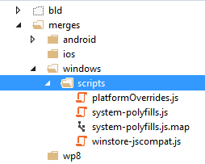

Update the code in platformOverrides.js.  platformOverrides.js is added to index.html by default. to add the system-polysills.js to the html. It’s important that system-polyfills loads before system.js in the index.html

Edit the merges &gt; windows &gt; scripts &gt; platformOverrrides.js to include system-polyfills.js

    (function () {
    // Append the safeHTML polyfill
    var scriptElem = document.createElement('script');
    var scriptElem2 = document.createElement('script');
    scriptElem.setAttribute('src', 'scripts/winstore-jscompat.js');
    scriptElem2.setAttribute('src', 'scripts/system-polyfills.js');
    if (document.body) {
    document.body.appendChild(scriptElem);
    document.body.appendChild(scriptElem2);
    } else {
    document.head.appendChild(scriptElem);
    document.head.appendChild(scriptElem2);
    }
    }());

Create mobiledeviceoverride.js
Adding a mobiledeviceoverride script disables es6-shim.js for mobile devices.  There is a problem with es6 shims in Cordova and this compensates.
    
    var isMobile = navigator.userAgent.match(/Android|BlackBerry|iPhone|iPad|iPod|Opera Mini|IEMobile/i);
    /\*\*
    \* Need to disable adding es6-shim.js for mobile devices. Let merges folder handle android, ios and windows additions.
    \* Error occurs in Windows Phone Universal when es6-shim.js is linked.
    \* es6-shim is necessary for all browsers.
    \*/
    if (isMobile == null) {
    var scriptElem = document.createElement('script');
    scriptElem.setAttribute('src', 'scripts/lib/es6-shim/es6-shim.js');
    if (document.body) {
    document.body.appendChild(scriptElem);
    } else {
    document.head.appendChild(scriptElem);
    }
    }

Updating index.html

    &lt;!-- Add system js --&gt;

    &lt;script src="scripts/jspm\_packages/system.js"&gt;&lt;/script&gt;

    &lt;script src="scripts/config.js"&gt;&lt;/script&gt;

    &lt;!-- Add mobile override --&gt;

    &lt;script src="scripts/mobileoverrride.js"&gt;&lt;/script&gt;

Debug to see if jQuery loads and displays the version number.

Try adding jquery with jspm, download the d.ts file with tsd, and check the version number the app.ts appExternalModuleTest.

# General Notes #

May require ADB to install the package manually. Visual Studio 2015 can sometimes create conflicts with devices.
adb install &lt;location of apk file&gt;

List and uninstall APPs on Android device using ADB

1.  Open Command Prompt

2.  CD to the ADB folder

    1.  C:\\Program Files (x86)\\Android\\android-sdk\\platform-tools

3.  Find the app

    1.  adb root

    2.  adb shell

    3.  pm list packages

4.  Uninstall the app

    1.  Adb uninstall &lt;name of package example io.cordova….&gt;

Problems with inline scripts in Windows store app
<https://github.com/MsopenTech/winstore-jscompat> -- add to the html and it will fix document.write by 3rd party javascript.

Publishing: Get it on the device
================================

Remember to review on physical devices.
